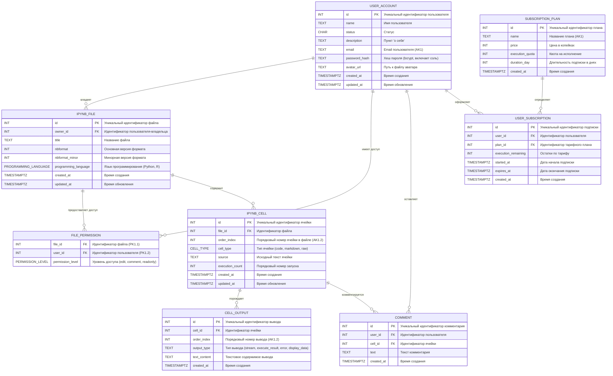

```mermaid
erDiagram
    USER_ACCOUNT {
        INT id PK "Уникальный идентификатор пользователя"
        TEXT name "Имя пользователя"
        CHAR status "Статус"
        TEXT description "Пункт 'о себе'"
        TEXT email "Email пользователя (AK1)"
        TEXT password_hash "Хеш пароля (bcrypt, включает соль)"
        TEXT avatar_url "Путь к файлу аватара"
        TIMESTAMPTZ created_at "Время создания"
        TIMESTAMPTZ updated_at "Время обновления"
    }
    IPYNB_FILE {
        INT id PK "Уникальный идентификатор файла"
        INT owner_id FK "Идентификатор пользователя-владельца"
        TEXT title "Название файла"
        INT nbformat "Основная версия формата"
        INT nbformat_minor "Минорная версия формата"
        PROGRAMMING_LANGUAGE programming_language "Язык программирования (Python, R)"
        TIMESTAMPTZ created_at "Время создания"
        TIMESTAMPTZ updated_at "Время обновления"
    }
    FILE_PERMISSION {
        INT file_id FK "Идентификатор файла (PK1.1)"
        INT user_id FK "Идентификатор пользователя (PK1.2)"
        PERMISSION_LEVEL permission_level "Уровень доступа (edit, comment, readonly)"
    }
    IPYNB_CELL {
        INT id PK "Уникальный идентификатор ячейки"
        INT file_id FK "Идентификатор файла"
        INT order_index "Порядковый номер ячейки в файле (AK1.2)"
        CELL_TYPE cell_type "Тип ячейки (code, markdown, raw)"
        TEXT source "Исходный текст ячейки"
        INT execution_count "Порядковый номер запуска"
        TIMESTAMPTZ created_at "Время создания"
        TIMESTAMPTZ updated_at "Время обновления"
    }
    CELL_OUTPUT {
        INT id PK "Уникальный идентификатор вывода"
        INT cell_id FK "Идентификатор ячейки"
        INT order_index "Порядковый номер вывода (AK1.2)"
        TEXT output_type "Тип вывода (stream, execute_result, error, display_data)"
        TEXT text_content "Текстовое содержимое вывода"
        TIMESTAMPTZ created_at "Время создания"
    }
    COMMENT {
        INT id PK "Уникальный идентификатор комментария"
        INT user_id FK "Идентификатор пользователя"
        INT cell_id FK "Идентификатор ячейки"
        TEXT text "Текст комментария"
        TIMESTAMPTZ created_at "Время создания"
    }
    SUBSCRIPTION_PLAN {
        INT id PK "Уникальный идентификатор плана"
        TEXT name "Название плана (AK1)"
        INT price "Цена в копейках"
        INT execution_quota "Квота на исполнение"
        INT duration_day "Длительность подписки в днях"
        TIMESTAMPTZ created_at "Время создания"
    }
    USER_SUBSCRIPTION {
        INT id PK "Уникальный идентификатор подписки"
        INT user_id FK "Идентификатор пользователя"
        INT plan_id FK "Идентификатор тарифного плана"
        INT execution_remaining "Остатки по тарифу"
        TIMESTAMPTZ started_at "Дата начала подписки"
        TIMESTAMPTZ expires_at "Дата окончания подписки"
        TIMESTAMPTZ created_at "Время создания"
    }

    USER_ACCOUNT ||--o{ IPYNB_FILE : "владеет"
    USER_ACCOUNT ||--o{ FILE_PERMISSION : "имеет доступ"
    USER_ACCOUNT ||--o{ COMMENT : "оставляет"
    USER_ACCOUNT ||--o{ USER_SUBSCRIPTION : "оформляет"

    IPYNB_FILE ||--o{ FILE_PERMISSION : "предоставляет доступ"
    IPYNB_FILE ||--o{ IPYNB_CELL : "содержит"

    IPYNB_CELL ||--o{ CELL_OUTPUT : "порождает"
    IPYNB_CELL ||--o{ COMMENT : "комментируется"

    SUBSCRIPTION_PLAN ||--o{ USER_SUBSCRIPTION : "определяет"
```
