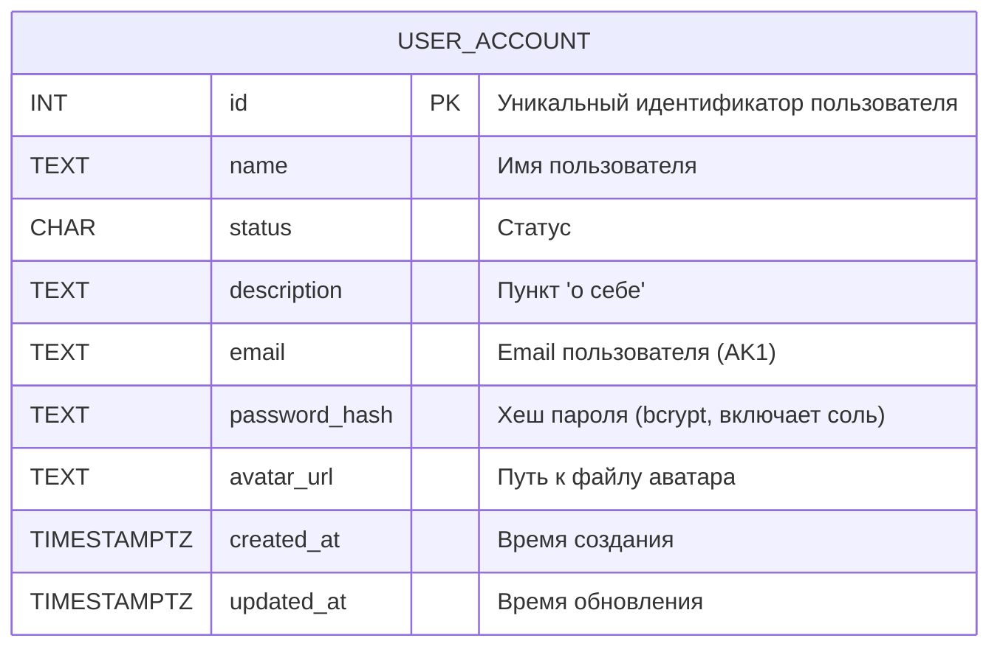
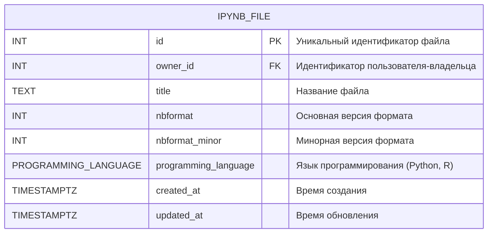
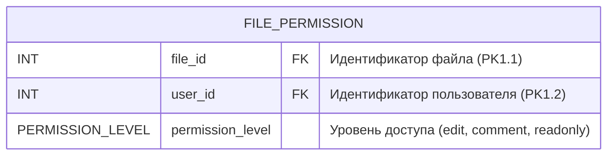
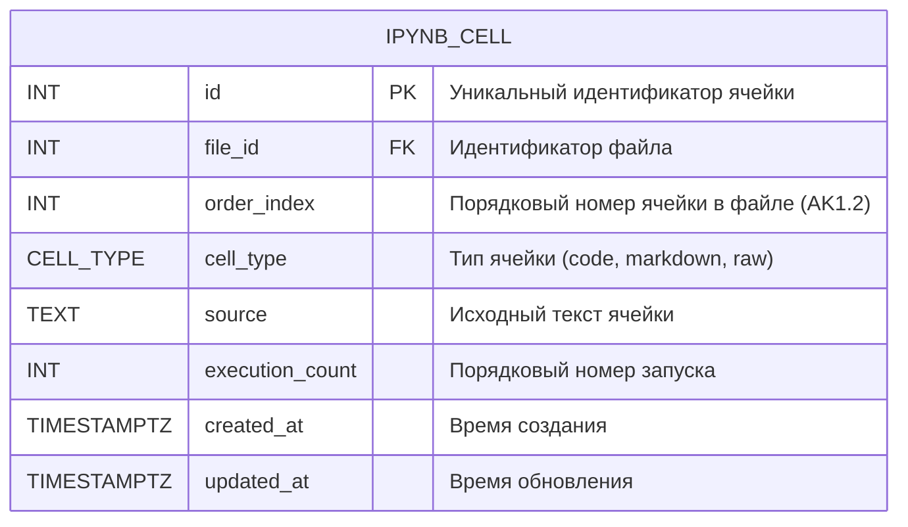
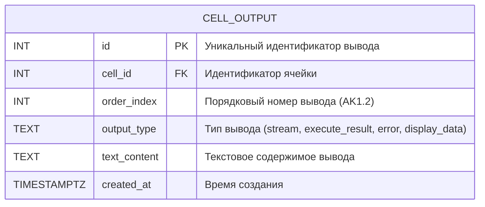
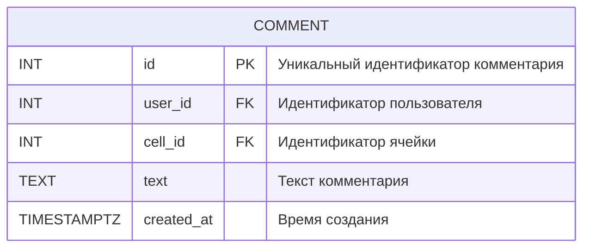
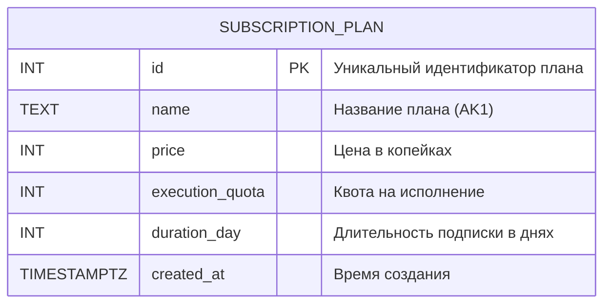
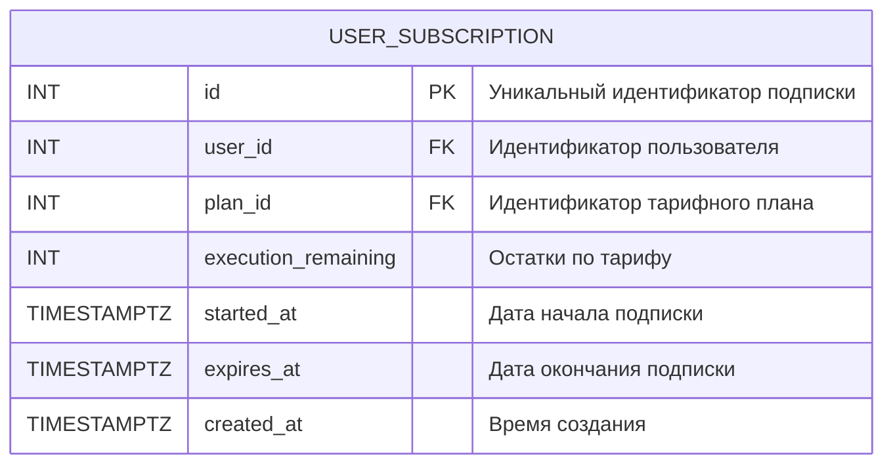

# Нормализация схемы базы данных — Проект KISS (Jupyter Notebooks)

---

## Таблица USER_ACCOUNT

Таблица `USER_ACCOUNT` содержит информацию о зарегистрированных пользователях системы.
Хранит учётные данные, хешированный пароль (bcrypt автоматически включает соль в хеш, поэтому отдельное поле `salt` не требуется) и ссылку на аватар.

 Функциональные зависимости: 

- `{id} -> {name, email, password_hash, avatar_url, created_at, updated_at}`
- `{email} -> {id, name, password_hash, avatar_url, created_at, updated_at}`

 Нормальные формы: 

- 1 НФ: Все атрибуты являются атомарными.
- 2 НФ: Все атрибуты полностью функционально зависят от первичного ключа id.
- 3 НФ: Все атрибуты не зависят от других неключевых атрибутов.
- НФБК: 3 НФ + в таблице отсутствуют составные ключи.

---

## Таблица IPYNB_FILE

Таблица `IPYNB_FILE` содержит информацию о файлах Jupyter Notebook.
Хранит версию формата, язык программирования и владельца файла. Поле `programming_language` реализовано как ENUM с допустимыми значениями `Python` и `R`.

 Функциональные зависимости: 

- `{id} -> {owner_id, title, nbformat, nbformat_minor, programming_language, created_at, updated_at}`

 Нормальные формы: 

- 1 НФ: Все атрибуты являются атомарными.
- 2 НФ: Все атрибуты полностью функционально зависят от первичного ключа id.
- 3 НФ: Все атрибуты не зависят от других неключевых атрибутов.
- НФБК: 3 НФ + в таблице отсутствуют составные ключи.

---

## Таблица FILE_PERMISSION

Таблица `FILE_PERMISSION` содержит информацию о правах доступа пользователей к файлам (шеринг).
Составной первичный ключ `{file_id, user_id}` гарантирует, что у одного пользователя может быть только одна запись доступа к конкретному файлу.

 Функциональные зависимости: 

- `{file_id, user_id} -> {permission_level}`

 Нормальные формы: 

- 1 НФ: Все атрибуты являются атомарными.
- 2 НФ: Атрибут permission_level полностью функционально зависит от составного ключа {file_id, user_id}.
- 3 НФ: Атрибут permission_level не зависит от других неключевых атрибутов.
- НФБК: 3 НФ + нет транзитивных зависимостей.

---

## Таблица IPYNB_CELL

Таблица `IPYNB_CELL` содержит информацию о ячейках (блоках) внутри файла Jupyter Notebook.
Поле `order_index` определяет порядок отображения ячеек внутри файла. Поле `cell_type` реализовано как ENUM с допустимыми значениями `code`, `markdown`, `raw`.

 Функциональные зависимости: 

- `{id} -> {file_id, order_index, cell_type, source, execution_count, created_at, updated_at}`
- `{file_id, order_index} -> {id, cell_type, source, execution_count, created_at, updated_at}`

 Нормальные формы: 

- 1 НФ: Все атрибуты являются атомарными.
- 2 НФ: Все атрибуты полностью функционально зависят от первичного ключа id.
- 3 НФ: Все атрибуты не зависят от других неключевых атрибутов.
- НФБК: 3 НФ + в таблице отсутствуют составные ключи.

---

## Таблица CELL_OUTPUT

Таблица `CELL_OUTPUT` содержит информацию о результатах исполнения ячеек с кодом.
Вместо хранения в JSONB (что запрещено на этапе нормализации), каждый выход хранится отдельной строкой. Поле `output_type` определяет тип результата, `order_index` — порядок вывода.

 Функциональные зависимости: 

- `{id} -> {cell_id, order_index, output_type, text_content, created_at}`
- `{cell_id, order_index} -> {id, output_type, text_content, created_at}`

 Нормальные формы: 

- 1 НФ: Все атрибуты являются атомарными.
- 2 НФ: Все атрибуты полностью функционально зависят от первичного ключа id.
- 3 НФ: Все атрибуты не зависят от других неключевых атрибутов.
- НФБК: 3 НФ + в таблице отсутствуют составные ключи.

---

## Таблица COMMENT

Таблица `COMMENT` содержит информацию о комментариях пользователей к ячейкам ноутбука.

 Функциональные зависимости: 

- `{id} -> {user_id, cell_id, text, created_at}`

 Нормальные формы: 

- 1 НФ: Все атрибуты являются атомарными.
- 2 НФ: Все атрибуты полностью функционально зависят от первичного ключа id.
- 3 НФ: Все атрибуты не зависят от других неключевых атрибутов.
- НФБК: 3 НФ + в таблице отсутствуют составные ключи.

---

## Таблица SUBSCRIPTION_PLAN

Таблица `SUBSCRIPTION_PLAN` содержит информацию о доступных тарифных планах подписки.
Необходима для монетизации (покупка подписок с квотой на исполнение).

 Функциональные зависимости: 

- `{id} -> {name, price, execution_quota, duration_day, created_at}`
- `{name} -> {id, price, execution_quota, duration_day, created_at}`

 Нормальные формы: 

- 1 НФ: Все атрибуты являются атомарными.
- 2 НФ: Все атрибуты полностью функционально зависят от первичного ключа id.
- 3 НФ: Все атрибуты не зависят от других неключевых атрибутов.
- НФБК: 3 НФ + в таблице отсутствуют составные ключи.

---

## Таблица USER_SUBSCRIPTION

Таблица `USER_SUBSCRIPTION` содержит информацию о подписках, приобретённых пользователями.
Хранит оставшуюся квоту исполнения и период действия подписки.

 Функциональные зависимости: 

- `{id} -> {user_id, plan_id, execution_remaining, started_at, expires_at, created_at}`

 Нормальные формы: 

- 1 НФ: Все атрибуты являются атомарными.
- 2 НФ: Все атрибуты полностью функционально зависят от первичного ключа id.
- 3 НФ: Все атрибуты не зависят от других неключевых атрибутов.
- НФБК: 3 НФ + в таблице отсутствуют составные ключи.

